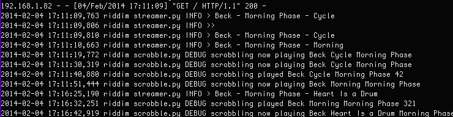
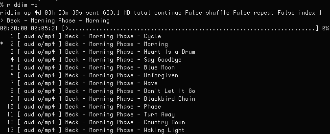

## What is it

**riddim** is a digital jukebox server written in python2 with the
following features:

        + CLI Playlist management
        + MP3 metadata stream encoding
        + Transcoding of all audio formats supported by FFmpeg
        + Track scrobbling to Last.fm
        + Low memory footprint

## Installation and mini-tutorial

In a first shell on the server computer:

```
# pip2 install mutagen scrobbler
% git clone https://github.com/noah/riddim.git
% cd riddim
% $EDITOR riddim.cfg
% ./riddim -k start
```

In a second shell on the server computer:

```
% ./riddim -e /path/to/some/music
```

On the client
```
% vlc -I curses http://localhost:18944
```

Music should now be coming out of your speakers.

Once the server is started, the playlist can be manipulated without
shutting down:

```bash
% riddim -e Siamese\ Dream                      # add a directory of tracks to the playlist ...
% riddim -e 03.\ Today.mp3                      # ... or a single track
% riddim -i 9                                   # skip to 9th track in the playlist
% riddim -c ^Smashing                           # clear tracks from playlist via regex pattern
% riddim -c .                                   # clear all tracks
% riddim -h                                     # show help
% aliased to riddim -q | less --pattern="^\*"   # show playlist at current track 
```

However, changes to the playlist will take some time to propogate to a
client listener - this value is determined by the variable `buffer_size`
in `riddim.cfg`.

## Screenshots

server output


query command



## Audioscrobbler

To scrobble tracks, `scrobble=True` must be set in `riddim.cfg` and a
`scrobbler.cfg` file in the following format is required:

    [scrobbler]
    username='Your Username'
    password='Your Password'

## Configuring Apache (optional)

**riddim** works well in combination with Apache or another web server.
The following configuration enables streaming from a `VirtualHost` (so
one can have a pretty url like `http://stream.some.tld`).  I use
something like this:

```
<VirtualHost *:80>
   ServerName stream.my.tld
   ServerAdmin me@my.tld
   ProxyPass / http://192.168.1.2:18944
</VirtualHost>      
```

Of course, **riddim** will need to be running on host
`192.168.1.2:18944` for that to work, but if it is set up correctly you
can open `http://stream.your.tld` from any music client to listen that
way (cough ... thus defeating corporate firewalls ...  cough).

## Contributors

I ripped off some code from Amarok for the streaming logic (lib/streamer).

## TODO

+ Web control (?)
